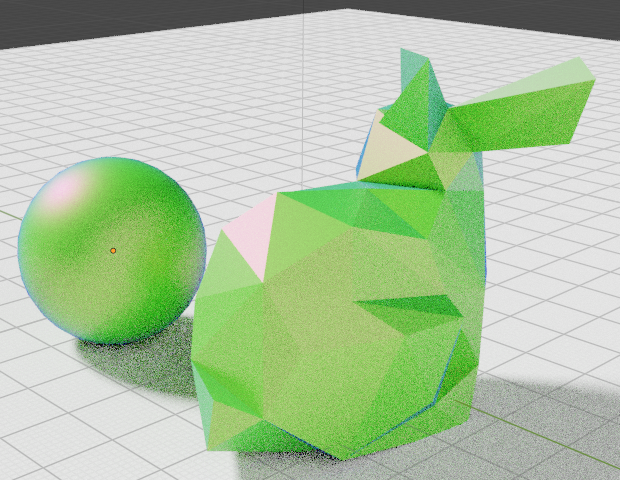

# Blender Helpful Presets

Tested in v3.4.1. All the materials are procedural.

### Materials collection

| Material  | Image | Material  | Image |
| ------------- | ------------- | ------------- | ------------- |
| [Shiny plastic](https://www.youtube.com/watch?v=vJZsTG2bUF4&ab_channel=blenderian)  |   | [Translucent plastic](https://www.youtube.com/watch?v=vJZsTG2bUF4&ab_channel=blenderian)  |   |
| (Car paint)[]  | Content Cell  | Content Cell  | Content Cell  |
| (Car paint)[]  | Content Cell  | Content Cell  | Content Cell  |

### Compositing presets

upd

### Geometry nodes

upd

generative blender design
