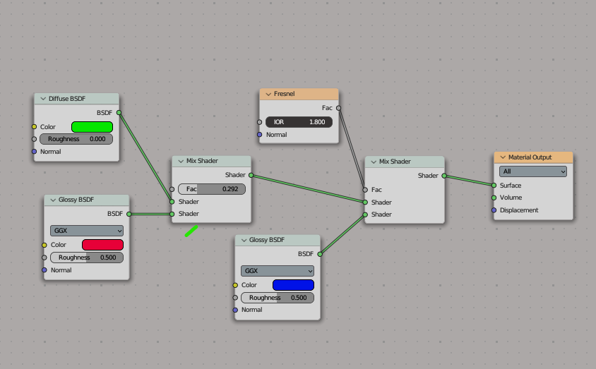

# Blender Helpful Presets

Tested in v3.4.1. All the materials are procedural.

### Materials collection

| Material  | Image | Node  | Material | Image | Node |
| ------------- | ------------- | ------------- | ------------- | ------------- | ------------- |
| [Shiny plastic](https://www.youtube.com/watch?v=vJZsTG2bUF4&ab_channel=blenderian)  |  |  | [Translucent plastic](https://www.youtube.com/watch?v=vJZsTG2bUF4&ab_channel=blenderian)  |   |  |
| (Car paint)[]  | Content Cell  | Content Cell  | Content Cell  | Content Cell  | Content Cell  |

### Lighting

Here are a few nice tutorials:

- [The Ultimate Guide to Portrait Lighting in Blender](https://www.youtube.com/watch?v=kKXTU1EImF4&ab_channel=FlippedNormals)
- [How to Composite Volumetric Lighting in Blender](https://www.youtube.com/watch?v=yLtjJ_bMNew&ab_channel=blenderisms)
- [12 Awesome COMPOSITOR EFFECTS for BLENDER](https://www.youtube.com/watch?v=8x2qfWNHedM&ab_channel=TheCGEssentials)
- [Blender Lighting Tutorial (from Cinematic Lighting course)](https://www.youtube.com/watch?v=1lsuB-teZ0E&ab_channel=GlebAlexandrov)

### Compositing presets

upd

### Geometry nodes

upd

generative blender design
